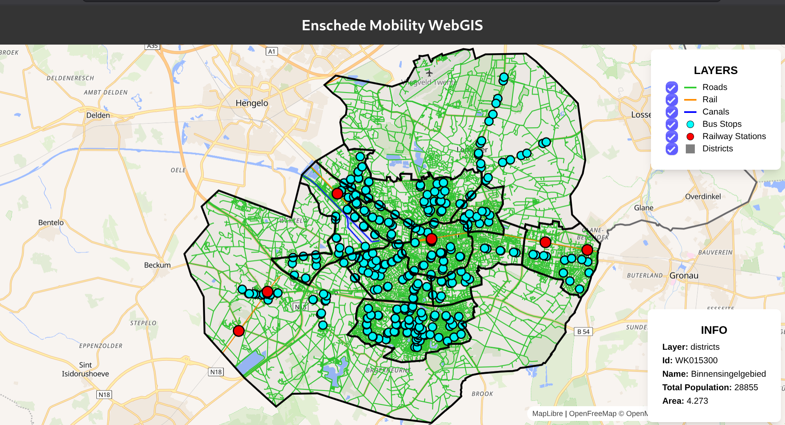

# Mobility Infrastructure WebGIS – Enschede

[](https://mobility-webgis.onrender.com) 

Interactive WebGIS for exploring mobility infrastructure in Enschede, Netherlands. Built with a PostGIS spatial backend and MapLibre client.



## Stack

* React + MapLibre (frontend)
* Node.js + Express (API)
* PostgreSQL + PostGIS (spatial database)
* Python + GeoPandas (data pipeline)
* Docker + Render (deployment)

## Data

* CBS Wijken & Buurten (district boundaries)
* OpenStreetMap (roads, rail, canals)

## Run locally

```bash
docker compose up -d --build
```

* **Frontend:** http://localhost:5173
* **API:** http://localhost:3000


## Repository structure

* **frontend:** React + MapLibre WebGIS client  
* **api:** Node.js Express spatial API  
* **scripts:** Python spatial data loader  
* **db:** PostGIS initialisation  
* **tools:** Python environment for data processing